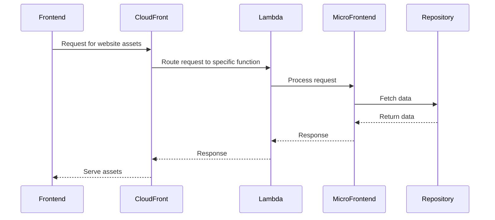

# 🏗 Architecture Documentation

## 📖 Context
* The repository contains code for deploying AWS CDK stacks for a website application that includes front-end, accounts, bookmarks, and products services.
* The goal is to provision infrastructure components such as S3 buckets, CloudFront distributions, and Lambda functions to support the website's functionality.

## 📖 Overview
* The architecture follows a serverless design pattern using AWS CDK to define and deploy cloud resources.
* Components include S3 buckets for storing website assets, CloudFront distributions for content delivery, and Lambda functions for serverless compute.
* The interactions involve serving static content from S3 via CloudFront and invoking Lambda functions for dynamic content.
* The architecture exhibits tight coupling between CloudFront distributions and Lambda functions, which can be improved for better separation of concerns.

## 🔹 Components
| Component | Description |
| --- | --- |
| FrontStack | Creates an S3 bucket for the front-end assets and sets up permissions for CloudFront. |
| CloudFrontStack | Configures CloudFront distributions for different services (accounts, bookmarks, products) with specific cache policies and origin settings. |
| MicroFrontEndFunctionsStack | Defines Lambda functions for handling requests related to accounts, bookmarks, and products. |
| AccountsHandler, BookmarksHandler, ProductHandler | Lambda function handlers for processing requests and interacting with the corresponding micro-frontends. |
| AccountsRepository, BookmarksRepository | Data repositories for fetching accounts and bookmarks information. |

## 🔄 Data Flow
* Data flows from the website's front-end assets stored in the S3 bucket through CloudFront distributions to the end-users.
* Requests for accounts, bookmarks, and products are routed to the respective Lambda functions via CloudFront behaviors.
* Lambda functions interact with the micro-frontends to process requests and retrieve data from the repositories.

## 🔍 Mermaid Diagram

## 🧱 Technologies
| Technology | Description |
| --- | --- |
| AWS CDK | Infrastructure as Code tool for defining cloud resources |
| AWS S3 | Object storage service for storing website assets |
| AWS CloudFront | Content delivery network for caching and serving content |
| AWS Lambda | Serverless compute service for executing code |
| TypeScript | Programming language for defining CDK constructs |

## 📝 **Codebase Evaluation**
Objective: Analyze the provided codebase for technical debt, focusing on dependency & coupling, code complexity, and cloud anti-patterns.
* **Dependency & Coupling**: The codebase shows tight coupling between CloudFront distributions and Lambda functions. Consider decoupling by introducing an API Gateway for better separation of concerns.
* **Code Complexity**: The codebase contains multiple classes and functions. Refactor to improve modularity and maintainability, considering splitting into smaller modules.
* **Cloud Anti-patterns**: Ensure sensitive information like secrets are not hardcoded in the code. Implement proper error handling mechanisms in Lambda functions to handle failures gracefully.

### Code Chunk Analysis:
* The code chunk includes configurations for CachePolicy, ViewerProtocolPolicy, and OriginRequestPolicy for CloudFront distributions.
* It sets up OriginAccessControl for Lambda functions, ensuring secure access.
* The code snippet also includes StringParameter for storing distribution domain name.
* The `MicroFrontEndFunctionsStack` class defines Lambda functions for product catalog and details handling.
* The `TypescriptFunction` class encapsulates the creation of Node.js Lambda functions with specific configurations.
* The `ProductsRepository` class provides methods for fetching catalog data and individual product details.
* The `CatalogHandler` and `ProductDetailsHandler` classes handle requests for catalog and product details respectively, with error handling and response generation.
* The `RequestHelper` class assists in decoding query string parameters for Lambda functions.

### Suggestions for Improvement:
* Refactor the code to separate concerns and reduce tight coupling between CloudFront and Lambda functions.
* Consider abstracting common functionalities into reusable modules to improve modularity.
* Implement environment variables or AWS Secrets Manager for managing sensitive information instead of hardcoding.
* Enhance error handling mechanisms in Lambda functions to provide informative responses for different scenarios.

This analysis provides insights into the code chunk's functionality and suggests improvements to enhance modularity, reduce coupling, and address potential cloud anti-patterns.