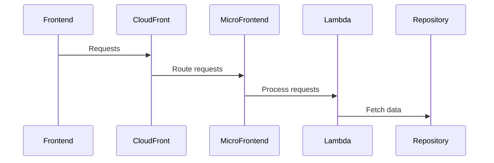

# 🏗 Architecture Documentation

## 📖 Context
The repository contains code for deploying a serverless application on AWS using the AWS Cloud Development Kit (CDK). The application consists of multiple micro-frontends for different services like products, bookmarks, and accounts. Each micro-frontend is deployed as a separate stack using CDK, and the front-end is served through CloudFront distributions. The code includes configurations for CloudFront distributions, S3 buckets, Lambda functions, and API Gateway endpoints.

## 📖 Overview
The architecture follows a serverless design pattern where each micro-frontend is a separate component responsible for handling specific functionalities. The application leverages AWS services like CloudFront for content delivery, S3 for storage, Lambda for serverless compute, and API Gateway for managing APIs. The components interact through HTTP requests and responses, with CloudFront acting as the entry point for the front-end application.

## 🔹 Components
| Component | Description |
| --- | --- |
| FrontStack | Creates an S3 bucket for the front-end application and sets up permissions for CloudFront. |
| CloudFrontStack | Configures CloudFront distributions for serving the front-end application and API endpoints. |
| MicroFrontEndFunctionsStack | Sets up Lambda functions for handling specific functionalities for each micro-frontend. |
| AccountsHandler, BookmarksHandler | Lambda functions responsible for handling requests related to accounts and bookmarks. |
| AccountsRepository, BookmarksRepository | Data repositories for fetching accounts and bookmarks data. |

## 🔄 Data Flow
The front-end application interacts with the CloudFront distributions, which route requests to the appropriate micro-frontends based on the URL path. The micro-frontends communicate with Lambda functions to process requests and retrieve data from the respective repositories.

## 🔍 Mermaid Diagram

## 🧱 Technologies
The main technologies used in the system include:
- Programming Languages: TypeScript
- Frameworks: AWS CDK
- AWS Services: CloudFront, S3, Lambda, API Gateway

## 📝 **Codebase Evaluation**
- **Dependency & Coupling**: The codebase shows tight coupling between CloudFront distributions, Lambda functions, and S3 buckets. Refactoring to decouple these components could improve modularity.
- **Code Complexity**: The codebase contains multiple configurations for CloudFront distributions and Lambda functions, which could lead to complexity. Simplifying these configurations could reduce complexity.
- **Cloud Anti-Patterns**:
  - **Hardcoded Secrets**: Ensure that secrets are not hardcoded in the codebase.
  - **Inefficient Scaling**: Monitor and optimize the scaling configurations for Lambda functions and CloudFront distributions.
  - **Error Handling**: Implement proper error handling mechanisms in Lambda functions and API Gateway endpoints.

- **Security Recommendations**:
  - Ensure secrets are stored in a secret manager.
  - Implement proper access controls and permissions for resources.
  - Use Web Application Firewall to protect the application when required.

- **Cost & Scalability Recommendations**:
  - Tag all resources with appropriate tags for cost tracking.
  - Implement lifecycle policies for storage resources to manage costs.
  - Ensure logs have a retention policy for cost optimization.

- **Infrastructure Complexity Reduction**:
  - Refactor the codebase to reduce coupling between components.
  - Simplify configurations for CloudFront distributions and Lambda functions.
  - Ensure consistent use of best practices for infrastructure as code.

- **Code Quality**:
  - Use linters and compilers to check code quality and enforce coding standards.
  - Implement automated testing to ensure the reliability of the application.

- **Resource Management**:
  - Implement lifecycle policies for storage resources to manage costs and optimize performance.
  - Scan container images for vulnerabilities and define lifecycle policies for them.

- **Overall Score**:
  - The codebase shows good usage of AWS services but could benefit from refactoring to improve modularity and reduce complexity. Security, cost, and scalability aspects need further attention for a more robust architecture.

This evaluation provides insights into improving the architecture's security, cost-effectiveness, and scalability while addressing technical debt and cloud anti-patterns.

## 📝 **Codebase Evaluation - Continued**
- **Dependency & Coupling**: The provided code chunk shows configurations for CachePolicy, ViewerProtocolPolicy, and OriginRequestPolicy within the CloudFrontStack. These configurations tightly couple the CloudFront distribution settings with specific behaviors and policies. Consider abstracting these configurations to separate modules for better modularity.
- **Code Complexity**: The code chunk includes direct property overrides for CloudFront distribution settings, which can lead to configuration sprawl and increased complexity. Consider encapsulating these overrides in a more structured and reusable manner to reduce complexity.
- **Cloud Anti-Patterns**:
  - **Hardcoded Secrets**: Ensure that any sensitive information, such as access control configurations, is not hardcoded in the codebase. Consider using parameter store or secrets manager for managing such information securely.
  - **Inefficient Scaling**: Review the scaling configurations for CloudFront distributions and Lambda functions to ensure they are optimized for performance and cost efficiency.
  - **Error Handling**: Implement robust error handling mechanisms within Lambda functions to gracefully manage exceptions and failures.

- **Security Recommendations**:
  - Refactor the code to externalize sensitive configurations like OriginAccessControlId to a secure storage solution.
  - Implement proper access controls and permissions for CloudFront distribution settings and Lambda functions.
  - Ensure that all security-sensitive configurations are managed securely and not exposed in the codebase.

- **Cost & Scalability Recommendations**:
  - Consider parameterizing the CachePolicy settings to allow for dynamic configuration changes without code modifications.
  - Evaluate the necessity of setting OriginAccessControlId directly in the code and explore more flexible and scalable alternatives.
  - Implement lifecycle policies for CloudFront distributions and associated resources to optimize costs and resource management.

- **Infrastructure Complexity Reduction**:
  - Abstract the CloudFront distribution configurations into reusable constructs to reduce duplication and improve maintainability.
  - Encapsulate the CachePolicy and ViewerProtocolPolicy settings within dedicated modules to enhance code organization and readability.

- **Code Quality**:
  - Ensure that the code adheres to consistent coding standards and best practices.
  - Consider implementing automated checks for security vulnerabilities and misconfigurations in the CloudFront settings.
  - Utilize linters and static code analysis tools to identify and address potential code quality issues.

- **Overall Score**:
  - The provided code chunk exhibits some coupling and complexity in the CloudFront distribution configurations. Refactoring these configurations for better modularity and security can enhance the overall architecture's robustness and maintainability.

This detailed evaluation highlights specific areas within the code chunk that can be improved to align with best practices and enhance the architecture's security, cost efficiency, and scalability.