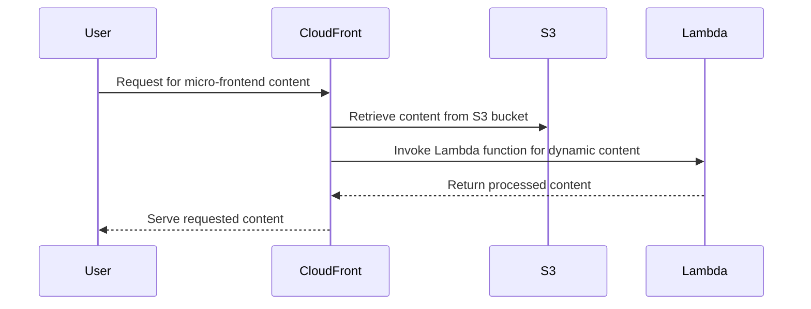

# 🏗 Architecture Documentation

## 📖 Context
* The repository contains code for deploying AWS CDK stacks for a website application consisting of multiple micro-frontends for products, bookmarks, and accounts.
* The goal is to set up the infrastructure for hosting these micro-frontends using AWS services like CloudFront, S3, and Lambda functions.

## 📖 Overview
* The architecture involves setting up CloudFront distributions for each micro-frontend to serve content securely over HTTPS.
* S3 buckets are used as origins for the CloudFront distributions, and Lambda functions are integrated for dynamic content generation.
* The system follows a serverless architecture pattern leveraging AWS CDK for infrastructure as code.

## 🔹 Components
| Component | Description |
| --- | --- |
| WebsiteStack | Main stack orchestrating the deployment of front-end resources. |
| FrontStack | Stack for setting up S3 bucket and CloudFront distribution for the front-end. |
| CloudFrontStack | Stack for configuring CloudFront distributions for micro-frontends. |
| MicroFrontEndFunctionsStack | Stack for defining Lambda functions for micro-frontends. |
| AccountsHandler, BookmarksHandler | Lambda function handlers for accounts and bookmarks micro-frontends. |
| AccountsRepository, BookmarksRepository | Data repositories for accounts and bookmarks. |

## 🔄 Data Flow
* Data flows from the user's request through CloudFront distributions to the respective micro-frontends hosted in S3 buckets.
* Lambda functions are invoked to process dynamic content requests based on the URL paths.
* Repositories fetch data based on the request parameters and return the necessary information to the handlers.

## 🔍 Mermaid Diagram

## 🧱 Technologies
| Technology | Description |
| --- | --- |
| AWS CDK | Infrastructure as code tool for deploying AWS resources |
| AWS CloudFront | Content delivery network service for secure content delivery |
| AWS S3 | Object storage service for hosting static website content |
| AWS Lambda | Serverless compute service for executing code in response to events |

## 📝 **Codebase Evaluation**
* The codebase uses AWS CDK to define infrastructure components as code, promoting reproducibility and scalability.
* The CloudFrontStack class sets up CloudFront distributions with appropriate cache policies and origin configurations.
* The Lambda functions handle dynamic content generation for micro-frontends based on request parameters.
* The repositories manage data retrieval for accounts and bookmarks micro-frontends.
* The codebase follows a modular structure with clear separation of concerns between components.

### Recommendations
* **Dependency & Coupling**: Ensure loose coupling between components by abstracting common functionalities into shared modules.
* **Code Complexity**: Refactor complex functions into smaller, more manageable units to improve readability and maintainability.
* **Security**: Implement proper access controls and encryption mechanisms for sensitive data handling in Lambda functions and repositories.
* **Cost Optimization**: Monitor and optimize resource usage to avoid unnecessary costs, especially in Lambda function invocations and S3 storage.
* **Scalability**: Design the system to scale horizontally by leveraging AWS services like Auto Scaling for Lambda functions and CloudFront distributions.
* **Infrastructure Complexity**: Simplify infrastructure setup by using AWS CDK constructs effectively and avoiding redundant configurations.

### Well-Architected Framework Pillars
* **Security**: Ensure secure data handling practices, implement least privilege access controls, and encrypt sensitive information at rest and in transit.
* **Cost Optimization**: Monitor resource usage, implement cost allocation tags, and optimize resource provisioning to minimize operational costs.
* **Reliability**: Design for fault tolerance, implement proper error handling, and use AWS services like CloudWatch for monitoring and alerting.
* **Performance Efficiency**: Optimize content delivery with caching strategies, leverage AWS services for efficient data processing, and monitor performance metrics.
* **Operational Excellence**: Implement automation for deployment and monitoring, establish clear operational procedures, and continuously improve processes.

### Infrastructure Complexity Reduction
* Refactor repetitive code segments into reusable constructs or helper functions to reduce duplication.
* Use AWS CDK constructs effectively to abstract common infrastructure patterns and simplify stack definitions.
* Implement consistent naming conventions and resource tagging to enhance visibility and manageability of resources.

### Cloud Anti-Patterns
* Avoid hardcoding sensitive information like access keys or secrets in the codebase; store them securely in AWS Secrets Manager.
* Ensure proper error handling and logging practices to facilitate troubleshooting and debugging in a serverless environment.
* Implement lifecycle policies for storage resources to manage data retention and optimize storage costs.
* Scan container images for vulnerabilities and define lifecycle policies for managing container resources efficiently.

By following these recommendations and best practices, the architecture can be further optimized for security, cost efficiency, and scalability while reducing complexity in the infrastructure setup.

---

### Codebase Analysis
* The provided code chunk includes configurations for CloudFront cache policies, origin access control, and distribution properties.
* It defines Lambda functions for product catalog and details, setting up the entry points and bundling configurations.
* The code registers handlers, repositories, and micro-frontends using dependency injection with `tsyringe`.
* The `ProductsRepository` class manages data retrieval for the product catalog.
* The `ActionResults` class provides response handling utilities for different HTTP status codes.
* The `RequestHelper` class assists in decoding query string parameters for Lambda functions.

### Recommendations for Codebase
* **Dependency & Coupling**: Consider abstracting common Lambda function configurations into reusable modules to reduce duplication.
* **Code Complexity**: Refactor Lambda function handlers to separate business logic from request handling for better maintainability.
* **Security**: Implement proper error handling and input validation in Lambda functions to prevent potential security vulnerabilities.
* **Cost Optimization**: Monitor Lambda function memory usage and optimize bundling configurations for efficient resource utilization.
* **Scalability**: Design Lambda functions to handle varying loads by configuring appropriate memory sizes and timeouts.
* **Infrastructure Complexity**: Simplify Lambda function setup by centralizing common configurations and dependencies.

By addressing these recommendations, the codebase can be enhanced for better modularity, security, and cost efficiency in the AWS CDK infrastructure setup.