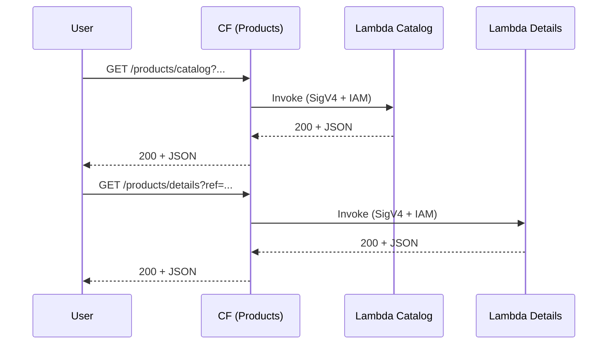

# 🏗 Architecture Documentation

## 📖 Context
* **Goal of the repository**  
  This monorepo implements a set of AWS-hosted micro-frontends. In particular, the **Products** domain comprises:
  1. Two **Lambda Function URLs** for “Catalog” and “Details” pages.
  2. A **CloudFront distribution** that fronts those two Lambda origins, applies caching policies, and exposes a single domain.
  3. An **SSM Parameter** storing the distribution’s domain name for use by the static front-end.

* **Used services & libraries**  
  - AWS CDK (v2) Constructs: NestedStack, CfnOriginAccessControl, CachePolicy, OriginRequestPolicy, StringParameter  
  - AWS Services: Lambda (Function URL), CloudFront, SSM Parameter Store  
  - Runtime & tooling: Node.js 20.x, TypeScript, esbuild bundling, tsyringe (DI), AWS Lambda Node.js Construct, aws-lambda types  

---

## 📖 Overview
The **ProductStack** provisions two nested stacks:

1. **MicroFrontEndFunctionsStack**  
   - Defines two `TypescriptFunction` Lambdas (`product-catalog-mfe-function`, `product-details-mfe-function`)  
   - Bundles with esbuild for ESM, injects a minimal runtime banner, attaches basic execution role and a one-day log group, and exposes a Function URL with IAM auth.

2. **CloudFrontStack**  
   - Creates a CloudFront distribution with two origins:  
     • Origin 0 → Catalog Function URL  
     • Origin 1 → Details Function URL  
   - Applies a shared `CfnOriginAccessControl` (SigV4) to both origins via low-level overrides.  
   - Applies a custom `CachePolicy` for product details (TTL: 0–24 h, default 1 h; no headers/cookies/queries) and `OriginRequestPolicy.ALL_VIEWER_EXCEPT_HOST_HEADER`.  
   - Enforces HTTPS (`REDIRECT_TO_HTTPS`) and writes the distribution domain name into SSM (`/products/distribution/domain/name`).

**Design patterns & decisions**  
- **NestedStacks** isolate function deployment from CDN provisioning.  
- **Low-level overrides** inject Origin Access Control on Lambda origins.  
- **Dependency Injection** via tsyringe for handler modularity.  
- **In-memory repository** for product data, simplifying prototyping.

---

## 🔹 Components  

| Component                             | Type                       | Responsibility                                                                                      | Interactions                                       |
|---------------------------------------|----------------------------|------------------------------------------------------------------------------------------------------|----------------------------------------------------|
| MicroFrontEndFunctionsStack           | CDK NestedStack            | Builds & deploys two Lambda Function URLs (`Catalog`, `Details`)                                     | Exposes `IFunctionUrl` for CloudFrontStack         |
| TypescriptFunction                    | CDK Construct              | Configures Node.js lambda (role, bundling, log group, Function URL, CORS, IAM auth, CF invoke grant) | Underlying Lambda Service                          |
| CloudFrontStack (Products)            | CDK NestedStack            | Creates CF distribution with two origins, cache/origin-request policies, HTTPS enforcement           | Uses `CfnOriginAccessControl`, `CachePolicy`, SSM  |
| CfnOriginAccessControl                | CDK L1 Construct           | Defines a SigV4 signing policy for Lambda origins                                                    | Attached to CF Origins via propertyOverride        |
| CachePolicy                           | CDK Construct              | Controls TTL (min=0, default=1h, max=24h), no headers/cookies/queries                                | Assigned to CF behaviors                           |
| StringParameter (/products/…/domain)  | CDK Construct              | Stores CF distribution domain name                                                                   | Read by WebsiteStack for API proxying              |
| CatalogHandler & ProductDetailsHandler| Application Code (TS)      | Decode query params, invoke DI-injected micro-frontend classes, return structured HTTP responses      | tsyringe container resolves dependencies           |
| ProductsRepository                    | Application Code (TS)      | Provides in-memory product list and lookup                                                         | Used by both handlers via DI                       |

---

## 🔄 Data Flow  

| Step | Actor / Component                         | Action                                                                                                                                         | Next Hop                                             |
|------|-------------------------------------------|------------------------------------------------------------------------------------------------------------------------------------------------|-------------------------------------------------------|
| 1    | User Browser                              | GET /products/catalog?ref=… or /products/details?ref=…                                                                                          | CloudFront distribution (Products)                    |
| 2    | CF (Products)                             | Select origin by path pattern → apply `ProductDetailsCachePolicy` or default cache policy; sign origin request via OAC                          | Lambda Function URL (Catalog or Details)              |
| 3    | Lambda Function URL                       | Invoke handler with IAM-signed event                                                                                                           | CatalogHandler or ProductDetailsHandler               |
| 4    | Handler                                   | Decode query args → call `mfe.Render(…)` → wrap result via `ActionResults.Success/BadRequest/...`                                               | Return JSON payload                                   |
| 5    | CloudFront                                | Cache or forward based on policy; deliver JSON                                                                                                 | User Browser                                          |

---

## 🔍 Mermaid Diagram

### Sequence Diagram

### Architecture-Beta Diagram

---

## 🧱 Technologies

| Layer              | Technology / Library                      |
|--------------------|-------------------------------------------|
| IAC & Infra        | AWS CDK v2, Constructs, TypeScript        |
| CDN & Networking   | CloudFront (CfnOriginAccessControl, CachePolicy, OriginRequestPolicy) |
| Compute            | AWS Lambda Function URL, NodejsFunction   |
| Config & Secrets   | SSM Parameter Store                       |
| DI & App Logic     | tsyringe, esbuild, aws-lambda types       |
| Logging            | AWS LogGroup (Retention 1 day)            |

---

## 📝 **Codebase Evaluation**

### Technical Debt & Coupling
- **Manual Overrides**  
  Two repeated `addPropertyOverride` calls for OAC assignment → extract into a loop or shared utility.  
- **Naming Typos**  
  IDs like `prodcut-catalog-mfe-function` contain misspellings.  
- **Single Shared OAC**  
  Both origins reuse one OAC → fine, but explicit origin indices (`0`, `1`) are brittle if origins reorder.

### Cloud Anti-Patterns
- **Low-Level L1 Overrides**  
  Directly patching distribution config increases fragility; consider high-level CF constructs with built-in OAC support.

### Actionable Refactoring
- Abstract “Function URL + CloudFront origin + OAC + cache policy” into a reusable Construct accepting an array of function URLs and behaviors.  
- Correct resource naming to prevent confusion and align with CFN outputs.  
- Parameterize TTLs and behavior patterns instead of hardcoded values.

### Well-Architected Recommendations
- **Security**  
  • Associate AWS WAF Web ACL to the CloudFront distribution.  
  • Further tighten IAM auth or JWT on Function URLs if public read is too open.  
- **Cost Optimization**  
  • Consolidate multiple CF distributions where feasible (e.g., Accounts/Bookmarks/Products).  
- **Reliability & Operations**  
  • Add CloudWatch alarms on Lambda error rates and 5xx CF responses.  
  • Enable CF access logs to an S3 bucket with lifecycle policies.

### Infrastructure Complexity Reduction
- Provide a single higher-level Construct `LambdaFunctionWithCfOac` to encapsulate common patterns.  
- Centralize cache/origin-request policy definitions.

---

### Best-Practice Scores

| Best Practice                                                                                | Score (/1) | Notes                                                                                       |
|----------------------------------------------------------------------------------------------|-----------|---------------------------------------------------------------------------------------------|
| All AWS resources tagged (`CostCenter`, `Environment`, `Application`, `Owner`)              | 0         | No tags applied in CDK.                                                                     |
| Web Application Firewall (WAF) used                                                         | 0         | No WAF associated with distributions.                                                       |
| All secrets in Secret Manager                                                               | 0         | No secrets stored; only distribution domain in SSM.                                         |
| Unpredictable resource IDs via Parameter Store                                              | 1         | Distribution domain stored in SSM.                                                          |
| Serverless functions sized appropriately (memory/time)                                       | 1         | Lambdas set to 256 MB/3 s; reasonable for current workloads.                                |
| All CloudWatch Logs have retention policies                                                 | 1         | Each Lambda has a LogGroup with 1-day retention.                                           |
| Linter & Compiler for code quality                                                          | 1         | TypeScript compiler used; no explicit linter step observed.                                |
| All storage resources define a lifecycle policy                                             | 0         | Buckets use RemovalPolicy but lack object lifecycle rules.                                  |
| Container images scanned & lifecycle policies                                               | N/A       | No containers in use.                                                                       |

_Total Score: 4/8 (excluding N/A)_