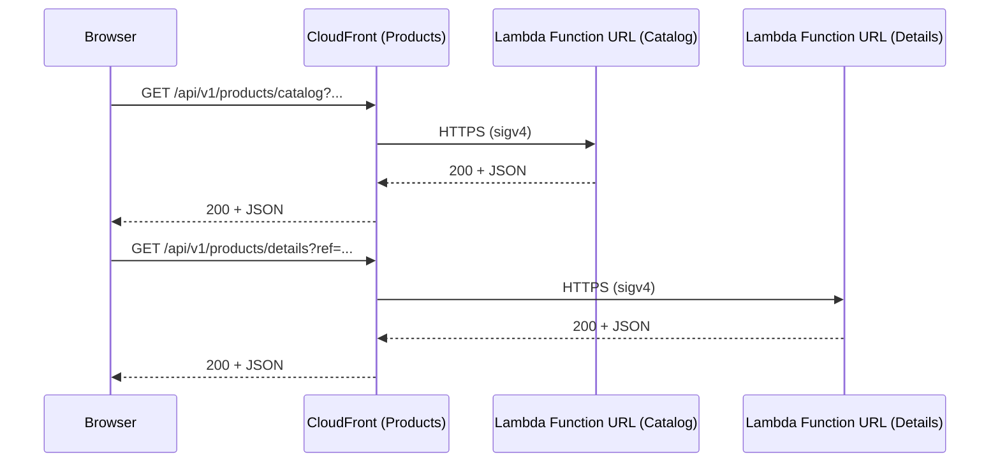

# 🏗 Architecture Documentation

## 📖 Context
*Goal of the Repository*  
This mono-repo codifies the AWS infrastructure and local tooling for a micro-frontends web application. It hosts a static front-end on S3/CloudFront and three dynamic micro-frontends (“accounts”, “bookmarks”, “products”) each backed by AWS Lambda Function URLs and fronted by CloudFront. A local Express server allows in-process invocation of handlers during development.

*Business Value*  
- Independently deployable front-end pieces, each with tailored caching and routing  
- Global low-latency delivery for both static assets and dynamic API calls  
- Fully IaC-driven, parameterized via SSM for cross-stack references  
- Rapid local iteration with a Lambda‐debug Express server  

*Used Services & Libraries*  
- AWS: S3, CloudFront (Distribution, OAC), Lambda (Function URLs), IAM, SSM Parameter Store  
- AWS CDK (TypeScript) & @cdk/constructs (TypescriptFunction, nested stacks)  
- Node.js, Express, tsyringe (DI), esbuild (bundling), dotenv  

---

## 📖 Overview
This iteration surfaces the **Products** micro-frontend’s specialized CloudFront caching/origin-control and the Lambda functions powering its catalog and detail pages:

1. **Micro-Frontend Functions**  
   - `MicroFrontEndFunctionsStack` defines two ARM64 Node.js Lambdas (catalog & details) via `TypescriptFunction`.  
   - Each Lambda has:  
     • A dedicated IAM role with `AWSLambdaBasicExecutionRole`  
     • A CloudWatch LogGroup with 1-day retention  
     • A Function URL (AWS_IAM auth + CORS)  
     • CloudFront invocation grants via Origin Access Control (OAC)  

2. **CloudFront Distribution for Products**  
   - `CloudFrontStack` (instantiated by `ProductStack`) creates a CF distribution with:  
     • **Two origins** (catalog & details Function URLs)  
     • `CachePolicy` (`defaultTtl=1h`, `maxTtl=24h`, `minTtl=0`)  
     • `OriginRequestPolicy` = `ALL_VIEWER_EXCEPT_HOST_HEADER`  
     • HTTPS enforcement (`redirect-to-https`)  
     • A single `CfnOriginAccessControl` (sigv4) attached to both origins  
     • SSM parameter `/products/distribution/domain/name` storing the distribution domain  

3. **Serverless Business Logic**  
   - **Handlers** (`CatalogHandler`, `ProductDetailsHandler`) decode query parameters, invoke a corresponding `…MicroFrontEnd.Render()` method, and wrap results in standardized `ActionResults`.  
   - **Repository** (`ProductsRepository`) holds a fake product list and filters it asynchronously.  
   - **Dependency Injection** via `tsyringe` wires handlers, repositories, and renderer classes.  

---

## 🔹 Components

| Component                               | Role & Responsibilities                                                                                              | Interactions                             |
|-----------------------------------------|----------------------------------------------------------------------------------------------------------------------|------------------------------------------|
| MicroFrontEndFunctionsStack             | Bundles & deploys two Node.js Lambdas (catalog, details) with Function URLs, IAM roles, log groups, CORS & OAC grants | Exposes `IFunctionUrl` to CloudFrontStack |
| TypescriptFunction                      | CDK construct (`NodejsFunction` subclass) adding: <br/>• IAM Role<br/>• LogGroup (1-day retention)<br/>• Function URL | GrantInvokeUrl to CloudFront OAC         |
| CloudFrontStack (Products)              | Provision CF Distribution with two origins, custom CachePolicy & OriginRequestPolicy, HTTPS redirect, OAC attachment | Fetches from Lambda Function URLs        |
| CfnOriginAccessControl (“LambdaUrlOAC”) | Defines a sigv4 Origin Access Control for Lambda Function URL origins                                                | Attached to both CF origins via overrides|
| StringParameter                         | Stores `/products/distribution/domain/name` in SSM for cross-stack use                                                | Consumed by front-end stacks             |
| CatalogHandler / ProductDetailsHandler  | Decode query params, call DI-injected MFE renderer, return standardized HTTP result                                  | Invoked by CF-to-Lambda requests         |
| ProductsRepository                      | Asynchronously filters an in-memory product list based on query parameters                                            | Used by handlers via DI                  |
| ActionResults & RequestHelper           | Utility classes for building HTTP responses and decoding query strings                                               | Shared by handlers                       |

---

## 🔄 Data Flow

| Step                                  | Client Request                                 | CloudFront Routing                                    | Lambda Handling                                   | Response Path                           |
|---------------------------------------|-------------------------------------------------|-------------------------------------------------------|----------------------------------------------------|-----------------------------------------|
| 1. Catalog list                       | GET `/api/v1/products/catalog?ref=…&seller=…`   | CF behavior → OriginIndex=0 (catalog Function URL)    | `CatalogHandler.Invoke` → `ProductsRepository.getCatalog(...)` → `ActionResults.Success(...)` | CF → Browser                           |
| 2. Product detail                     | GET `/api/v1/products/details?ref=…`           | CF behavior → OriginIndex=1 (details Function URL)    | `ProductDetailsHandler.Invoke` → `ProductsRepository.getProduct(...)` → `ActionResults.Success(...)` | CF → Browser                           |
| 3. CF domain stored                   | —                                               | —                                                     | —                                                  | SSM `/products/distribution/domain/name`|

---

## 🔍 Mermaid Diagram

### Sequence Diagram


### Architecture Diagram
```mermaid
flowchart LR
  subgraph ProductsMicroFrontend
    subgraph Functions
      CatF[Catalog Lambda<br/>(TypescriptFunction)]
      DetF[Details Lambda<br/>(TypescriptFunction)]
    end
    subgraph CloudFront
      CFDist[CF Distribution<br/>(Products)]
      OAC[Origin Access Control<br/>(sigv4)]
      CatF-- origin -->CFDist
      DetF-- origin -->CFDist
      CFDist-.->OAC
    end
    CFDist-->SSM[SSM Parameter<br/>'/products/distribution/domain/name']
  end
  Browser-->CFDist
```

---

## 🧱 Technologies

| Category          | Technology / Library                                      |
|-------------------|-----------------------------------------------------------|
| IaC               | AWS CDK (TypeScript), Cfn constructs                      |
| Compute           | AWS Lambda Function URLs, NodejsFunction (ARM_64)         |
| CDN & Caching     | AWS CloudFront, CachePolicy, OriginRequestPolicy, OAC     |
| Storage & Config  | SSM Parameter Store                                       |
| CI/CD & Bundling  | esbuild (via aws-lambda-nodejs), TypeScript               |
| DI & Testing      | tsyringe, jest (not shown in chunk)                       |

---

## 📝 **Codebase Evaluation**

### Technical Debt & Anti-Patterns
- **Coupling**: Handlers and repository wired via DI—modular and testable  
- **Complexity**: Two similar handler stacks; consider abstracting common DI registrations  
- **Cloud Anti-Patterns**:  
  • No WAF on CF<br/>• CloudFront access logs not enabled<br/>• Static front-end lifecycle policies not shown here  

### Actionable Refactoring
1. **CloudFront Reuse**: Extract common cache/origin settings (TTL, policies) into a shared construct.  
2. **Handler Bootstrapping**: Consolidate DI container registration into a single module rather than per-handler file.  
3. **Parameterization**: Expose OAC name and signing protocol via props for reuse across MFEs.

### Well-Architected Recommendations
- **Security**  
  • Attach AWS WAF to CF distributions  
  • Enforce least privilege on Lambda IAM roles  
- **Cost Optimization**  
  • Review TTLs (1h default, 24h max)—tune per-endpoint volatility  
  • Add S3 lifecycle policies to front-end bucket  
- **Reliability & Operations**  
  • Enable CF access logging with S3 target + retention policy  
  • Tag all CDK resources (`CostCenter`, `Environment`, `Application`, `Owner`) via Aspects  
- **Performance Efficiency**  
  • OriginRequestPolicy already omits unnecessary headers  
  • Verify HTTP/3 is enabled globally  

### Well-Architected Scoring

| Criterion                                                             | Present? | Score |
|-----------------------------------------------------------------------|:--------:|:-----:|
| All resources tagged (`CostCenter`,`Environment`,`Application`,`Owner`)| No       | 0/1   |
| WAF on CloudFront                                                     | No       | 0/1   |
| Secrets in Secrets Manager                                            | No       | 0/1   |
| Unpredictable IDs in Parameter Store                                  | Yes      | 1/1   |
| Serverless sizing appropriate (256 MB, 3 s)                            | Yes      | 1/1   |
| All logs have retention policies                                      | Partial* | 0.5/1 |
| Linter & compiler in CI                                               | Not shown| 0/1   |
| S3 lifecycle policies                                                 | No       | 0/1   |
| Container/image scanning & lifecycle                                  | N/A      | 0/1   |

\* **Lambda** logs: 1-day retention; **CloudFront** access logs: not enabled.

**Overall Well-Architected Score:** 2.5 / 9

---

**Next Steps**  
- Enable CF access logging and attach WAF  
- Introduce tagging via CDK Aspects, define S3 lifecycle rules  
- Consolidate DI registration and CDK caching constructs for reuse