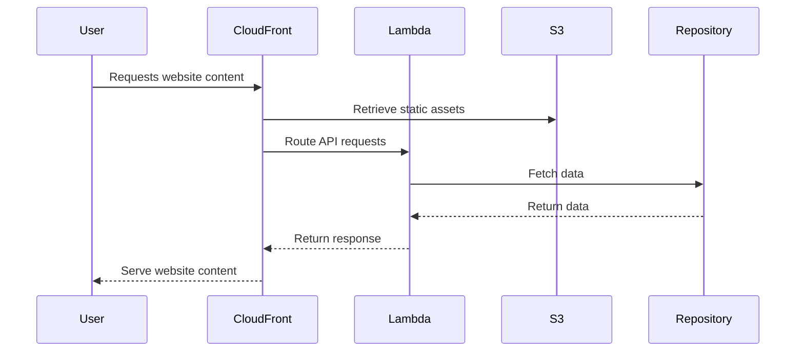

# 🏗 Architecture Documentation

## 📖 Context
* The repository contains code for deploying AWS CDK stacks for a website application that includes front-end, accounts, bookmarks, and products services.
* The goal is to provision infrastructure components such as S3 buckets, CloudFront distributions, and Lambda functions to host and serve the website and its services.

## 📖 Overview
* The architecture follows a serverless approach using AWS CDK to define and deploy cloud resources.
* Components include S3 buckets for storing website assets, CloudFront distributions for content delivery, and Lambda functions for serverless compute.
* The interactions involve serving static content from S3 via CloudFront and invoking Lambda functions for dynamic content.
* The architecture leverages AWS services for scalable and cost-effective hosting of the website and its services.

## 🔹 Components
| Component | Description |
| --- | --- |
| FrontStack | Creates an S3 bucket for the front-end website and sets up permissions for CloudFront. |
| CloudFrontStack | Configures CloudFront distributions for different services (accounts, bookmarks, products) with specific cache policies and origin settings. |
| MicroFrontEndFunctionsStack | Defines Lambda functions for handling requests related to accounts, bookmarks, and products. |
| AccountsHandler, BookmarksHandler, ProductHandler | Lambda function handlers for processing requests and interacting with corresponding repositories. |
| AccountsRepository, BookmarksRepository | Repositories for fetching data related to accounts and bookmarks. |

## 🔄 Data Flow
* Data flows from the website's S3 bucket through CloudFront distributions to the end-users.
* Requests for accounts, bookmarks, and products are routed to the respective Lambda functions for processing.
* Lambda functions interact with repositories to fetch data based on the request parameters.

## 🔍 Mermaid Diagram

## 🧱 Technologies
| Technology | Description |
| --- | --- |
| AWS CDK | Infrastructure as Code tool for defining cloud resources |
| AWS S3 | Object storage service for hosting website assets |
| AWS CloudFront | Content delivery network for caching and serving content |
| AWS Lambda | Serverless compute service for executing code |
| TypeScript | Programming language for defining CDK constructs |

## 📝 **Codebase Evaluation**
Objective: Analyze the provided codebase for technical debt, focusing on dependency & coupling, code complexity, and cloud anti-patterns.
* **Dependency & Coupling**: The codebase shows tight coupling between CloudFront distributions and Lambda functions. Consider decoupling by introducing an API Gateway for better separation of concerns.
* **Code Complexity**: The codebase contains multiple Lambda functions and configurations, which might lead to maintenance challenges. Consider refactoring common logic into shared modules to reduce complexity.
* **Cloud Anti-patterns**: Ensure sensitive information like secrets and credentials are not hardcoded in the code. Implement secure handling of environment variables and secrets using AWS Parameter Store or Secrets Manager.

### Code Chunk Analysis:
The provided code chunk includes configurations for CloudFront distributions and Lambda functions. It sets cache policies, viewer protocol policies, and origin access control for CloudFront. It also defines Lambda functions using TypescriptFunction with specific entry points and bundling configurations.

Suggestions for Improvement:
1. **Separation of Concerns**: Consider separating the CloudFront configurations and Lambda function definitions into distinct modules for better maintainability.
2. **Code Reusability**: Identify common logic across Lambda functions and extract them into shared modules to reduce duplication and improve code reusability.
3. **Environment Variables**: Avoid hardcoding sensitive information like access control configurations. Utilize AWS Parameter Store or Secrets Manager for secure storage and retrieval of such data.

By addressing these suggestions, the codebase can be enhanced in terms of modularity, maintainability, and security practices.