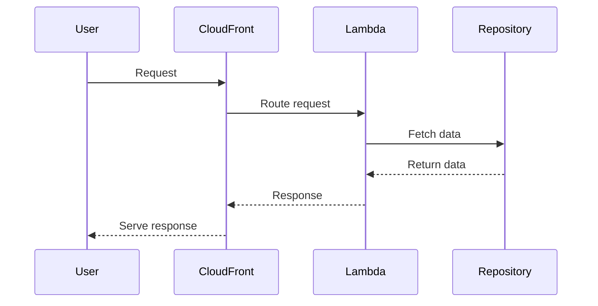

# 🏗 Architecture Documentation

## 📖 Context
The repository contains code for deploying AWS CloudFormation stacks using the AWS Cloud Development Kit (CDK). It includes stacks for a website, accounts, bookmarks, and products, each with their respective functionalities.

## 📖 Overview
The architecture leverages AWS CDK to define infrastructure as code for deploying various services on AWS. It includes components for a website, accounts, bookmarks, and products, each serving different purposes within the application ecosystem. The CDK constructs define CloudFront distributions, S3 buckets, Lambda functions, and other resources required for the application.

## 🔹 Components
| Component | Description |
| --- | --- |
| WebsiteStack | Defines the stack for the website, including CloudFront distribution and S3 bucket for hosting the website content. |
| FrontStack | Manages the S3 bucket for the front-end of the application and sets up permissions for CloudFront access. |
| CloudFrontStack | Configures the CloudFront distribution for the website, accounts, bookmarks, and products, including cache policies and origin access controls. |
| MicroFrontEndFunctionsStack | Sets up Lambda functions for handling specific functionalities related to accounts, bookmarks, and products. |
| AccountsHandler, BookmarksHandler, ProductHandler | Lambda function handlers for accounts, bookmarks, and products, respectively. |
| AccountsRepository, BookmarksRepository | Repositories for fetching data related to accounts and bookmarks. |

## 🔄 Data Flow
The data flow involves requests being routed through the CloudFront distributions to the respective Lambda functions based on the API paths. The Lambda functions interact with the repositories to fetch data and process requests accordingly.

## 🔍 Mermaid Diagram

## 🧱 Technologies
The main technologies used in the system include:
- Programming Languages: TypeScript
- Frameworks: AWS CDK
- AWS Services: CloudFront, S3, Lambda, SSM

## 📝 **Codebase Evaluation**
### Technical Debt Analysis
- **Dependency & Coupling**: The codebase shows tight coupling between CloudFront distributions, Lambda functions, and S3 buckets. Refactoring to decouple these components would improve modularity.
- **Code Complexity**: The codebase contains multiple constructs and configurations, leading to complexity. Simplifying the setup and breaking down into smaller components could reduce complexity.
- **Cloud Anti-patterns**: The code includes hardcoded values for distribution paths and domain names, which can be a security risk. Using SSM Parameter Store for storing sensitive information and dynamic values would enhance security.

### Recommendations
- **Refactoring**: Separate concerns by breaking down the stacks into smaller, more modular components to reduce coupling and improve maintainability.
- **Security Enhancement**: Utilize SSM Parameter Store for storing sensitive information like domain names and paths to avoid hardcoded values.
- **Cost Optimization**: Implement caching strategies effectively to reduce unnecessary requests and optimize costs.
- **Scalability Improvement**: Consider implementing auto-scaling mechanisms for Lambda functions based on traffic patterns to enhance scalability.

### Complexity Reduction
- **Infrastructure Simplification**: Abstract common configurations into reusable constructs to reduce duplication and simplify the infrastructure setup.
- **Configuration Management**: Centralize configuration values and secrets management to avoid scattered hardcoded values across the codebase.

By addressing these recommendations, the system can enhance security, reduce complexity, optimize costs, and improve scalability while adhering to well-architected framework principles.

### Code Chunk Analysis
The provided code chunk includes configurations for CachePolicy, ViewerProtocolPolicy, OriginRequestPolicy, and setting up OriginAccessControl for CloudFront distributions. It also defines Lambda functions using TypescriptFunction and registers dependencies using tsyringe for CatalogHandler, ProductDetailsHandler, and ProductsRepository. The code demonstrates the setup of Lambda functions, S3 buckets, and IAM policies for CloudFront access.

#### Technical Debt Analysis
- **Dependency & Coupling**: The code chunk shows the configuration of CloudFront distributions and Lambda functions, indicating a level of coupling between these components. Consider abstracting common configurations to reduce coupling.
- **Code Complexity**: The code includes detailed configurations for cache policies and access controls, which can contribute to complexity. Simplifying these configurations where possible would enhance maintainability.
- **Cloud Anti-patterns**: The code includes hardcoded values for distribution paths and access controls, which can be a security risk. Consider parameterizing these values using SSM Parameter Store for better security practices.

#### Recommendations
- **Refactoring**: Abstract common configurations into reusable constructs to reduce duplication and improve modularity.
- **Security Enhancement**: Parameterize sensitive values and access controls to avoid hardcoded configurations.
- **Code Simplification**: Simplify complex configurations to improve readability and maintainability.

Overall, the code chunk aligns with the existing architecture but may benefit from refactoring to enhance modularity and reduce complexity.

## 📝 **Next Steps**
In the next iteration, further analyze the codebase for additional technical debt related to dependency injection, Lambda function configurations, and IAM policies. Provide actionable suggestions for improving modularity, security, and maintainability in line with well-architected framework principles.