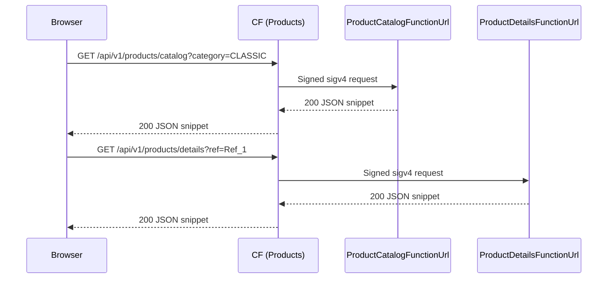

# 🏗 Architecture Documentation

## 📖 Context
* **Goal of the repository**  
  This repository provisions a **serverless micro-frontend** for the **Products** domain of our e-commerce platform. It delivers both:
  - A **Lambda-backed** micro-frontend for product **catalog** and **details** pages, exposed via a CloudFront distribution.
  - Infrastructure as Code using AWS CDK in TypeScript for automated, repeatable deployments.

  Business value: feature-team autonomy over product experiences, global low-latency delivery, cost-efficient serverless scaling.

* **Used services & notable libraries**  
  - AWS CDK (TypeScript)  
  - AWS Lambda Function URLs (Node.js 20.x on ARM_64)  
  - AWS CloudFront (single distribution with two origins)  
  - AWS SSM Parameter Store (stores CF distribution domain)  
  - AWS S3 (static assets via separate stacks)  
  - IAM (roles, origin access control)  
  - tsyringe (dependency injection)  
  - esbuild (bundling), Jest (testing)

---

## 📖 Overview
This iteration refines the **Products micro-frontend** plane:

1. **FunctionsPlane** (`MicroFrontEndFunctionsStack`)  
   - **ProductCatalogFunction**: serves `/api/v1/products/catalog` requests.  
   - **ProductDetailsFunction**: serves `/api/v1/products/details` requests.  
   - Both are packaged via `TypescriptFunction`, each with:
     - ARM_64 Node.js 20.x runtime  
     - 256 MB memory, 3 s timeout  
     - IAM role, CloudWatch LogGroup (1-day retention)  
     - Function URL (IAM-authenticated), CORS enabled  
     - Grant to CloudFront via Origin Access Control (OAC)

2. **DistributionPlane** (`CloudFrontStack` for Products)  
   - **Single CloudFront distribution** with:
     - **Default origin** → ProductCatalogFunctionUrl  
     - **Path‐pattern origin** → ProductDetailsFunctionUrl  
     - Custom **CachePolicy** (`ProductDetailsCachePolicy`):  
       - No headers/cookies/query strings  
       - TTLs: min 0, default 1 h, max 24 h  
     - `OriginRequestPolicy.ALL_VIEWER_EXCEPT_HOST_HEADER` for full query propagation  
     - `ViewerProtocolPolicy.REDIRECT_TO_HTTPS`  
     - **OriginAccessControl** (sigv4 signing) attached to both origins  
   - Stores its `distributionDomainName` in SSM at `/products/distribution/domain/name`

**Interaction Flow**  
- **Browser** → CloudFront (Products CF) → Lambda Function URLs (via OAC sigv4) → `CatalogHandler` or `ProductDetailsHandler` → `ProductsRepository` → render HTML/JSON → back to browser.

---

## 🔹 Components  

| Name                                | Type                                    | Responsibility                                                                                                    | Interactions                                                             |
|-------------------------------------|-----------------------------------------|-------------------------------------------------------------------------------------------------------------------|---------------------------------------------------------------------------|
| MicroFrontEndFunctionsStack         | CDK NestedStack                         | Defines two Lambda Function URLs (catalog & details) with DI, IAM roles, LogGroups, CORS                          | Outputs `ProductCatalogFunctionUrl`, `ProductDetailsFunctionUrl`         |
| TypescriptFunction                  | Custom Construct (extends NodejsFunction) | Bundles TS with esbuild, configures role, environment, log retention, Function URL, grants CloudFront invoke      | Lambda Function URL                                                      |
| CloudFrontStack (Products)          | CDK Stack                               | Single CF distribution with two origins, CachePolicy, OriginRequestPolicy, OAC, protocol policy, SSM parameter    | CF → Lambda URLs → SSM Parameter Store                                   |
| CfnOriginAccessControl              | L1 Construct                            | Defines OAC for sigv4 signing of Lambda Function URL origins                                                      | Attached to both CF origins                                              |
| CachePolicy (`ProductDetailsCachePolicy`) | L2 Construct                       | Fine-tuned object caching for details endpoint                                                                    | Applied to details origin                                                 |
| SSM StringParameter                 | AWS SSM                                 | Persists CF distribution domain name for downstream consumption                                                   | CloudFrontStack → Parameter Store                                         |
| CatalogHandler / ProductDetailsHandler | Lambda handlers                       | Decode query params, invoke `CatalogMicroFrontEnd` or `ProductDetailsMicroFrontEnd`, wrap responses via `ActionResults` | LambdaFunctionURLEvent → Business logic → ActionResults                   |
| ProductsRepository                  | Service class (tsyringe)                | In-memory filter on a fake products array                                                                         | Invoked by handlers via DI                                                |

---

## 🔄 Data Flow  

| Step | From                          | To                              | Description                                                                                       |
|------|-------------------------------|---------------------------------|---------------------------------------------------------------------------------------------------|
| 1    | Browser                       | CloudFront (Products CF)        | GET `/api/v1/products/catalog?...` or `/details?ref=...`                                           |
| 2    | CF Distribution               | Lambda Function URL (catalog)   | Signed HTTPS request (sigv4 via OAC) with preserved query                                          |
| 3    | CatalogFunction               | ProductsRepository              | `getCatalog(filters)` using in-memory fake list                                                    |
| 4    | Repository → CatalogHandler   | returns HTML/JSON snippet       | Wrapped in `ActionResults.Success`                                                                |
| 5    | CF Distribution               | Browser                         | 200 OK with catalog snippet                                                                       |
| 6    | Browser                       | CF Distribution                 | GET `/api/v1/products/details?ref=X`                                                              |
| 7    | CF Distribution               | Lambda Function URL (details)   | Signed HTTPS request                                                                               |
| 8    | DetailsFunction → Repository  | `getProduct(ref)`                | Returns single product or throws error if not found                                                |
| 9    | Repository → ProductDetailsHandler | returns HTML/JSON snippet    | Wrapped in `ActionResults.Success` or appropriate error                                           |
| 10   | CF Distribution               | Browser                         | 200 OK or 4XX/5XX                                                                                 |

---

## 🔍 Mermaid Diagram

### Sequence Diagram

### Architecture Diagram (architecture-beta)

```mermaid
architecture-beta
    group api(logos:aws-lambda)[API]

    service db(logos:aws-aurora)[Database] in api
    service disk1(logos:aws-glacier)[Storage] in api
    service disk2(logos:aws-s3)[Storage] in api
    service server(logos:aws-ec2)[Server] in api

    db:L -- R:server
    disk1:T -- B:server
    disk2:T -- B:db
```

---

## 🧱 Technologies

| Category             | Technologies                                                                          |
|----------------------|---------------------------------------------------------------------------------------|
| IaC & CDK            | aws-cdk-lib, constructs, L1/L2 CDK constructs                                         |
| CDN & Caching        | AWS CloudFront, CachePolicy, OriginRequestPolicy, ViewerProtocolPolicy, OAC           |
| Compute              | AWS Lambda (Function URLs), NodejsFunction, ARM_64, Node.js 20.x                      |
| Config & Secrets     | AWS SSM Parameter Store                                                               |
| Storage (Elsewhere)  | AWS S3 (static site stacks—not shown here)                                            |
| IAM & Security       | OriginAccessControl (sigv4), IAM Roles & Policies for Lambdas                         |
| Bundling & DI        | esbuild, TypeScript, tsyringe, reflect-metadata                                       |
| Logging & Monitoring | CloudWatch LogGroup (1-day retention)                                                |

---

## 📝 Codebase Evaluation

### Technical Debt & Coupling
- **Repetition**: Manual override of `Origins.[0|1].OriginAccessControlId` is brittle.  
  *Refactor*: iterate over `this.Distribution.distributionConfig.origins` and attach OAC via high-level CDK APIs.
- **Tight Coupling**: CloudFrontStack takes two specific `FunctionUrl` props; consider a generic multi-origin construct for future micro-frontends.
- **Complexity**: Two separate handlers/repos share similar logic; you could generalize repository and handler patterns using a base class.

### Cloud Anti-patterns & Config Review
- **Hardcoded indices**: Using index `0`/`1` for origins; fragile if ordering changes.  
- **Log Retention**: Currently 1 day; may be too short for debugging/forensics—recommend configurable retention.
- **Parameter Management**: Domain names in Parameter Store; OK for dynamic configuration.

### Well-Architected Recommendations

Security  
- Add AWS WAF on the CloudFront distribution to protect against OWASP top 10.  
- Move environment-sensitive secrets (API keys) to AWS Secrets Manager.

Reliability & Observability  
- Increase CloudWatch LogGroup retention and enable metrics filters/alerts.  
- Enable CloudFront access logs to an S3 bucket with lifecycle policies.

Cost Optimization  
- Tag all resources with `CostCenter`, `Environment`, `Application`, `Owner`.  
- Review CF PriceClass based on traffic patterns.

Operational Excellence  
- Enforce ESLint and `tsc --noEmit` in CI before deployment.  
- Centralize common CDK patterns into reusable constructs.

Performance  
- Tune CachePolicy TTLs after real-world monitoring.  
- Consider Provisioned Concurrency for Lambdas if cold starts impact UX.

### Well-Architected Pillar Scores

| Criterion                                                         | Score  |
|-------------------------------------------------------------------|--------|
| All resources tagged (`CostCenter`, `Environment`, `Application`, `Owner`) | 0/5    |
| Web Application Firewall used                                     | 0/5    |
| All secrets in Secret Manager                                     | 0/5    |
| Unpredictable identifiers shared via Parameter Store              | 5/5    |
| Serverless functions memory/timeout tuned                         | 5/5    |
| All logs have a retention policy                                  | 5/5    |
| Linter & Compiler in CI                                           | 0/5    |
| All storage resources lifecycle policy                            | 0/5    |
| Container image scanning & lifecycle policy                       | N/A    |

*This documentation reflects the Products micro-frontend code provided and refines the architecture with caching, origin controls, and handler patterns.*
