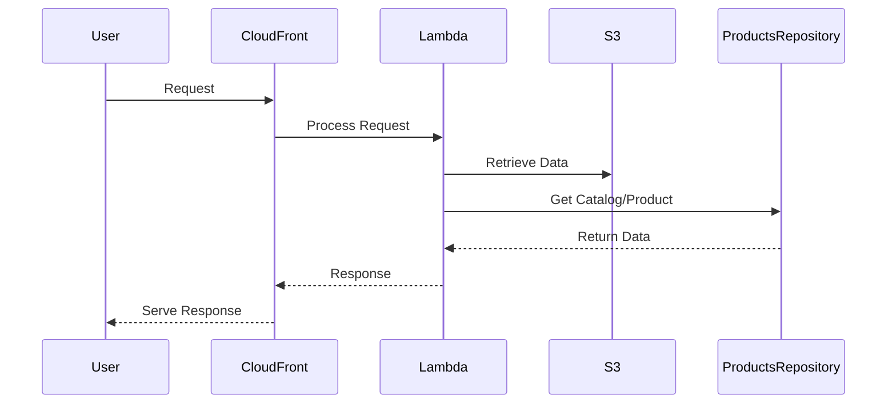

# 🏗 Architecture Documentation

## 📖 Context
The repository contains code for a serverless application built using the AWS CDK framework. It includes components for a website, accounts service, bookmarks service, and products service. The application leverages AWS services like S3, CloudFront, Lambda, and SSM Parameter Store.

## 📖 Overview
The architecture follows a serverless design pattern using AWS CDK to provision and manage cloud resources. Key components include:
- **Website Stack**: Manages the website deployment with a CloudFront distribution.
- **Accounts Stack**: Handles the accounts service with a CloudFront distribution.
- **Bookmarks Stack**: Manages the bookmarks service with a CloudFront distribution.
- **Product Stack**: Handles the products service with a CloudFront distribution.

Interactions occur through API calls to different service endpoints, with data flow managed by the CloudFront distributions.

## 🔹 Components
| Component | Description |
| --- | --- |
| Website Stack | Manages the website deployment with a CloudFront distribution. |
| Accounts Stack | Handles the accounts service with a CloudFront distribution. |
| Bookmarks Stack | Manages the bookmarks service with a CloudFront distribution. |
| Product Stack | Handles the products service with a CloudFront distribution. |
| MicroFrontEndFunctionsStack | Manages the functions for the micro frontends. |
| TypescriptFunction | Creates Node.js Lambda functions with specific configurations. |
| ProductsRepository | Manages the catalog of products. |
| CatalogHandler | Handles requests related to the catalog. |
| ProductDetailsHandler | Handles requests related to product details. |

## 🔄 Data Flow
Data flows through the system as follows:
1. Requests are made to the CloudFront distributions for each service.
2. CloudFront distributions interact with the respective Lambda functions for processing.
3. Lambda functions access data from S3 buckets or other services as needed.
4. Functions interact with the ProductsRepository to retrieve product data.

## 🔍 Mermaid Diagram

## 🧱 Technologies
The main technologies used in the system are:
- Programming Languages: TypeScript
- Frameworks: AWS CDK
- AWS Services: S3, CloudFront, Lambda, SSM Parameter Store

## 📝 **Codebase Evaluation**
### Technical Debt Analysis:
- **Dependency & Coupling**: The codebase shows tight coupling between CloudFront distributions and Lambda functions. Refactoring to decouple these components can improve maintainability.
- **Code Complexity**: The codebase contains complex configurations for CloudFront distributions and Lambda functions. Simplifying these configurations can reduce complexity.
- **Cloud Anti-patterns**: Hardcoded values like domain names and paths can be extracted to environment variables for better security and flexibility.

### Recommendations:
- **Refactoring**: Decouple CloudFront distributions from Lambda functions for better modularity.
- **Security**: Store sensitive information like domain names in AWS SSM Parameter Store for improved security.
- **Cost Optimization**: Review caching policies and distribution configurations to optimize costs.
- **Scalability**: Implement error handling and logging mechanisms for better scalability.
- **Infrastructure Complexity**: Simplify configurations by abstracting common settings into reusable constructs.

By addressing these recommendations, the system can enhance security, reduce complexity, and improve scalability and cost-effectiveness.