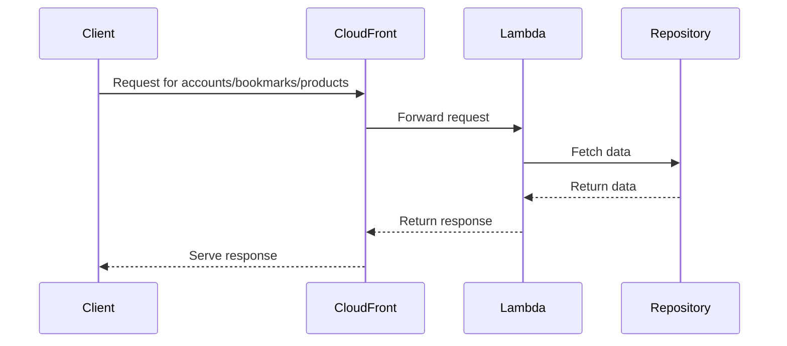

# 🏗 Architecture Documentation

## 📖 Context
The repository contains code for a serverless application built using the AWS CDK framework. It includes components for a website, accounts service, bookmarks service, and product service. The application leverages AWS services like CloudFront, S3, Lambda, and SSM.

## 📖 Overview
The architecture consists of multiple nested stacks for different services. The website stack includes a CloudFront distribution for the website content. The accounts, bookmarks, and product stacks each have their own CloudFront distributions for their respective services. The components interact through API calls and serve content based on different paths. The system follows a serverless architecture pattern leveraging AWS services for scalability and flexibility.

## 🔹 Components
The main components and their roles are as follows:

| Component | Description |
| --- | --- |
| WebsiteStack | Manages the website content and deploys a CloudFront distribution. |
| FrontStack | Manages the front-end bucket and sets up permissions for CloudFront. |
| CloudFrontStack | Creates CloudFront distributions for different services and sets up caching policies. |
| MicroFrontEndFunctionsStack | Sets up Lambda functions for micro-frontends. |
| AccountsHandler, BookmarksHandler, ProductHandler | Lambda functions handling requests for accounts, bookmarks, and products. |
| AccountsRepository, BookmarksRepository | Manages data retrieval for accounts and bookmarks. |

## 🔄 Data Flow
The data flows through the system as follows:
1. Requests are made to the CloudFront distributions for accounts, bookmarks, and products.
2. CloudFront distributions interact with the respective Lambda functions for processing.
3. Lambda functions communicate with the repositories to fetch data.
4. Responses are sent back through CloudFront to the clients. The system follows a request-response flow for serving content to users.

## 🔍 Mermaid Diagram

## 🧱 Technologies
The main technologies used in the system are:
- Programming Languages: TypeScript
- Frameworks: AWS CDK
- AWS Services: CloudFront, S3, Lambda, SSM

## 📝 **Codebase Evaluation**
### Recommendations:
- **Dependency & Coupling**: Consider decoupling the Lambda functions from specific repositories by introducing a service layer to handle data retrieval. This will reduce tight coupling and improve modularity.
- **Code Complexity**: Refactor Lambda functions to separate business logic from data access to reduce complexity. Implement a clear separation of concerns for better maintainability.
- **Cloud Anti-patterns**: Avoid hardcoding secrets in the codebase; consider using AWS Secrets Manager for secure storage to enhance security.
- **Security**: Implement proper authorization mechanisms to restrict access to sensitive data. Ensure that only authorized users can access the data.
- **Cost**: Monitor and optimize the usage of AWS services to reduce unnecessary costs. Implement cost-effective strategies like auto-scaling for Lambda functions.
- **Scalability**: Implement auto-scaling configurations for Lambda functions to handle varying loads efficiently. Ensure the system can scale based on demand.
- **Infrastructure Complexity**: Simplify infrastructure by grouping related resources and using consistent naming conventions. This will make the system easier to manage and maintain.

By addressing these recommendations, the system can improve its modularity, security, cost-effectiveness, and scalability while reducing infrastructure complexity. Refactoring the codebase to follow best practices will lead to a more robust and maintainable architecture.