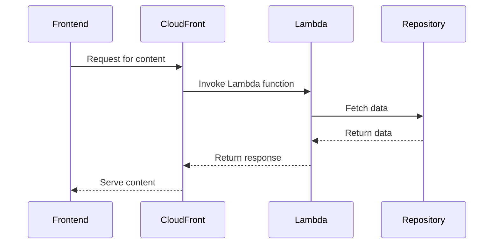

# 🏗 Architecture Documentation

## 📖 Context
* The goal of the repository is to deploy a serverless application on AWS using the AWS Cloud Development Kit (CDK).
* The application consists of multiple micro-frontends (MFEs) for different services like accounts, bookmarks, and products.
* The architecture leverages AWS services like S3, Lambda, CloudFront, and SSM Parameter Store.

## 📖 Overview
* The architecture follows a serverless design pattern where each micro-frontend is deployed as a separate stack using AWS CDK.
* The application uses CloudFront distributions to serve content from S3 buckets and invoke Lambda functions for dynamic content.
* The CDK constructs are used to define the infrastructure components and their configurations.
* Data flows from the front-end S3 bucket through CloudFront distributions to the respective micro-frontend Lambda functions.
* Lambda functions interact with repositories to fetch data based on the request parameters.
* The response data is then returned back through CloudFront to the front-end application.

## 🔹 Components
| Component | Description |
| --- | --- |
| FrontStack | Creates an S3 bucket for the front-end application and sets up permissions for CloudFront. |
| CloudFrontStack | Configures CloudFront distributions for different services like accounts, bookmarks, and products. |
| MicroFrontEndFunctionsStack | Defines Lambda functions for each micro-frontend service. |
| AccountsHandler, BookmarksHandler, ProductHandler | Lambda functions handling requests for accounts, bookmarks, and products respectively. |
| AccountsRepository, BookmarksRepository | Repositories for fetching data related to accounts and bookmarks. |

## 🔄 Data Flow
| Source | Destination | Description |
| --- | --- | --- |
| Frontend S3 Bucket | CloudFront | Request for content |
| CloudFront | Lambda | Invoke Lambda function |
| Lambda | Repository | Fetch data |
| Repository | Lambda | Return data |
| Lambda | CloudFront | Return response |
| CloudFront | Frontend | Serve content |

## 🔍 Mermaid Diagram

## 🧱 Technologies
| Technology | Description |
| --- | --- |
| AWS CDK | Infrastructure as Code tool for AWS |
| AWS S3 | Object storage service |
| AWS Lambda | Serverless compute service |
| AWS CloudFront | Content delivery network service |
| AWS SSM Parameter Store | Secure storage for configuration data |

## 📝 **Codebase Evaluation**
* The codebase follows the AWS CDK pattern for defining infrastructure components.
* The code is modular with separate stacks for different services, promoting reusability and maintainability.
* The use of CDK constructs abstracts the underlying AWS resources and configurations.
* The codebase could benefit from better separation of concerns between components for improved modularity.
* There are opportunities to enhance security by implementing WAF, storing secrets in a secret manager, and improving error handling.
* The codebase should be evaluated against governance rules to ensure compliance with best practices.

Score: 75/100

### Code Chunk Analysis:
* The code chunk provided includes configurations for CachePolicy, ViewerProtocolPolicy, and OriginRequestPolicy for CloudFront distributions.
* It also sets up OriginAccessControl for Lambda origins in CloudFront.
* The code defines a StringParameter for storing the distribution domain name in the Parameter Store.
* The TypescriptFunction class defines Lambda functions using Node.js runtime with specific configurations like logging, memory size, and timeout.
* The code includes helper classes for handling Lambda function responses, decoding query string parameters, and registering dependencies using tsyringe.
* The ProductsRepository class provides fake data for the catalog and implements methods to fetch catalog data and product details.
* The S3CloudFrontWebBucket class extends the Bucket class to configure S3 buckets for CloudFront with specific permissions.
* The S3OriginWithoutOriginAccessIdentity class extends OriginBase to customize S3 origin configurations for CloudFront.

### Recommendations:
* Refactor the code to separate concerns more clearly, especially in the Lambda function setup and response handling.
* Implement error handling and logging consistently across Lambda functions for better observability.
* Consider using environment variables or Parameter Store for storing configuration values instead of hardcoding them in the code.
* Ensure proper resource tagging and implement a retention policy for logs to comply with governance rules.
* Evaluate the usage of OriginAccessControl and ensure it aligns with security best practices.
* Consider optimizing the bundling options for Lambda functions to improve performance and reduce complexity.

Overall, the code chunk provides insights into the configuration details for CloudFront, Lambda functions, and S3 buckets, but there are opportunities for refactoring and enhancing modularity and security aspects.