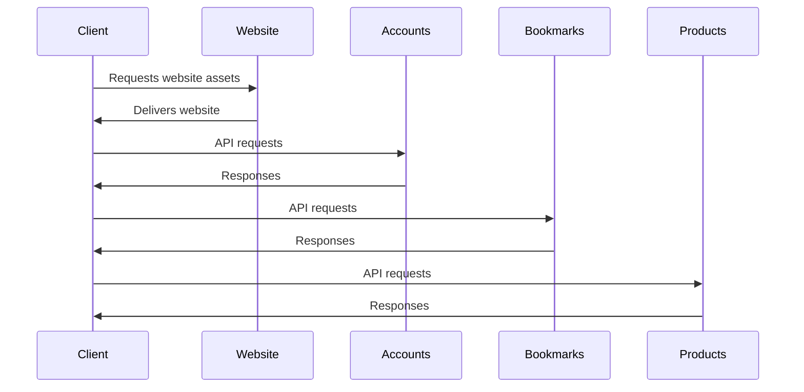

# 🏗 Architecture Documentation

## 📖 Context
The repository contains code for a serverless application built using the AWS Cloud Development Kit (CDK). It includes components for a website, accounts service, bookmarks service, and products service. The goal is to deploy these services on AWS using infrastructure as code.

## 📖 Overview
The architecture consists of multiple nested stacks, each responsible for different services. The main components include:
- **Website Stack**: Contains the frontend website assets and deploys them to an S3 bucket with CloudFront distribution.
- **Accounts Stack**: Manages the accounts service, including Lambda functions and CloudFront distribution.
- **Bookmarks Stack**: Handles the bookmarks service, with Lambda functions and CloudFront distribution.
- **Product Stack**: Manages the products service, including Lambda functions and CloudFront distribution.

The components interact through API Gateway endpoints and Lambda functions triggered by CloudFront distributions.

## 🔹 Components
| Component         | Description                                                                                           |
|-------------------|-------------------------------------------------------------------------------------------------------|
| Website Stack     | Deploys frontend assets to an S3 bucket and sets up a CloudFront distribution for the website.        |
| Accounts Stack    | Manages the accounts service, including Lambda functions and CloudFront distribution.                 |
| Bookmarks Stack   | Handles the bookmarks service, with Lambda functions and CloudFront distribution.                     |
| Product Stack     | Manages the products service, including Lambda functions and CloudFront distribution.                 |

## 🔄 Data Flow
The data flow involves clients interacting with the frontend website hosted on S3 through CloudFront distributions. The website makes API calls to the accounts, bookmarks, and products services, which are served by Lambda functions triggered by CloudFront.

## 🔍 Mermaid Diagram

## 🧱 Technologies
The main technologies used in the system:
- Programming Languages: TypeScript
- Frameworks: AWS CDK
- Services: AWS S3, AWS CloudFront, AWS Lambda

## 📝 **Codebase Evaluation**
### Technical Debt Analysis:
- **Dependency & Coupling**: The codebase shows tight coupling between components like CloudFront distributions and Lambda functions. Refactoring to decouple these components can improve maintainability.
- **Code Complexity**: The codebase includes complex configurations for CloudFront distributions and Lambda functions. Simplifying these configurations can reduce complexity.
- **Cloud Anti-patterns**: The code includes hardcoded values like distribution paths and domain names, which should be parameterized for better flexibility.

### Recommendations:
- **Refactoring**: Separate concerns by decoupling CloudFront distributions from Lambda functions using event-driven architecture.
- **Security**: Implement proper access controls and encryption for sensitive data in S3 buckets and Lambda functions.
- **Cost Optimization**: Utilize caching strategies effectively to reduce data transfer costs and improve performance.
- **Scalability**: Implement auto-scaling for Lambda functions based on traffic patterns to handle varying loads efficiently.
- **Infrastructure Complexity**: Simplify infrastructure by abstracting common configurations into reusable constructs for better modularity.

### Governance Rules:
1. Tag all resources with "CostCenter", "Environment", "Application", "Owner" tags for better resource management.
2. Use a Web Application Firewall to protect the application from common web threats.
3. Store all secrets securely in a secret manager to prevent exposure.
4. Share identifiers for unpredictable resources via parameter store for consistency.
5. Prefer serverless containers over serverless functions for high memory and execution time requirements.
6. Implement a retention policy for logs to manage storage costs and compliance.
7. Use linters and compilers to enforce code quality standards and best practices.

By following these recommendations and governance rules, the system can enhance security, reduce costs, improve scalability, and simplify infrastructure complexity.

### Codebase Analysis:
- The provided code chunk includes configurations for CachePolicy, ViewerProtocolPolicy, and OriginRequestPolicy for CloudFront distributions.
- It also defines Lambda functions using the TypescriptFunction class, bundling TypeScript code for execution.
- The code demonstrates the usage of tsyringe for dependency injection and registration of handlers for API endpoints.
- There are implementations for handling API requests and responses in CatalogHandler and ProductDetailsHandler classes.
- The ProductsRepository class simulates data retrieval for the catalog of products.
- The S3CloudFrontWebBucket class extends the Bucket class for CloudFront web buckets with specific configurations.
- The TypescriptFunction class encapsulates Lambda function creation with specific configurations like logging and IAM permissions.
- The RequestHelper class provides utility functions for decoding query string parameters.

### Recommendations:
- **Modularity**: Consider breaking down the code into smaller, more focused modules to improve maintainability and reusability.
- **Error Handling**: Enhance error handling mechanisms to provide more informative responses to API requests.
- **Security**: Ensure proper IAM permissions and access controls are implemented for Lambda functions and S3 buckets.
- **Testing**: Implement unit tests to validate the functionality of individual components and handlers.
- **Documentation**: Enhance code documentation to improve readability and understanding for future developers.

By addressing these recommendations, the codebase can be further optimized for modularity, security, and maintainability.