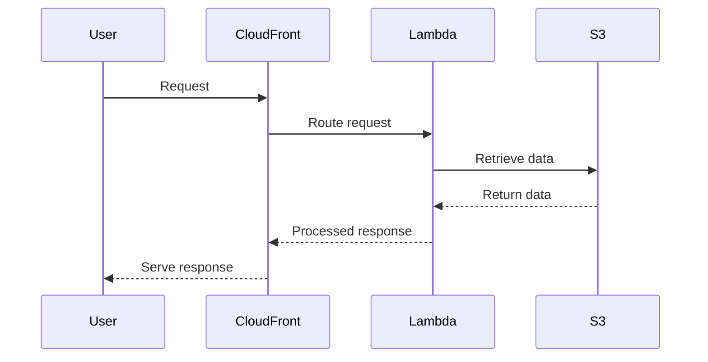

# 🏗 Architecture Documentation

## 📖 Context
The repository contains code for a serverless application built using the AWS Cloud Development Kit (CDK). It includes stacks for a website, accounts, bookmarks, and products, each with their respective functionalities. The application leverages AWS services like S3, CloudFront, Lambda, and SSM for various functionalities.

## 📖 Overview
The architecture follows a serverless design pattern using AWS CDK to provision resources. It consists of different stacks for modularity and scalability. Requests are routed through CloudFront distributions to Lambda functions, which interact with S3 buckets for data retrieval and processing.

## 🔹 Components
| Component | Description |
| --- | --- |
| WebsiteStack | Main website deployment with CloudFront distribution and S3 bucket. |
| FrontStack | Front-end resources stack with S3 bucket and CloudFront distribution. |
| CloudFrontStack | Stack for configuring CloudFront distributions. |
| MicroFrontEndFunctionsStack | Stack defining Lambda functions for micro front-end services. |
| AccountsHandler | Lambda function handler for accounts service. |
| BookmarksHandler | Lambda function handler for bookmarks service. |
| BookmarksRepository | Repository managing bookmarks data. |
| ProductStack | Product service deployment stack with CloudFront distribution. |

## 🔄 Data Flow
Requests from users are routed through CloudFront distributions to the respective Lambda functions based on the service being accessed. Lambda functions interact with S3 buckets to retrieve and process data before responding back through CloudFront to the users.

## 🔍 Mermaid Diagram

## 🧱 Technologies
| Technology | Description |
| --- | --- |
| AWS CDK | Infrastructure as Code framework for provisioning AWS resources |
| AWS S3 | Object storage service for hosting static assets |
| AWS CloudFront | Content delivery network for caching and serving content |
| AWS Lambda | Serverless compute service for executing code |
| AWS SSM | AWS Systems Manager for parameter storage |

## 📝 **Codebase Evaluation**
- **Technical Debt Analysis**:
  - **Dependency & Coupling**: The codebase exhibits tight coupling between CloudFront distributions, Lambda functions, and S3 buckets. Decoupling these components can enhance maintainability.
  - **Code Complexity**: The codebase contains multiple stacks and Lambda functions, leading to complexity. Simplifying the structure and breaking it down into smaller components can reduce complexity.
  - **Cloud Anti-patterns**: Hardcoded values like file paths and domain names should be parameterized for improved flexibility and security.

- **Recommendations**:
  - **Security**: Implement proper access controls and encryption mechanisms for sensitive data. Utilize AWS Secrets Manager for secure storage of secrets.
  - **Cost Optimization**: Opt for serverless containers over serverless functions for high memory and execution time requirements to optimize costs.
  - **Scalability**: Ensure robust error handling and logging mechanisms for improved scalability and monitoring.
  - **Infrastructure Complexity**: Refactor the codebase to reduce interdependencies between components and enhance modularity.

- **Governance Rules Evaluation**:
  - **Tagging**: Ensure all resources are tagged with the required tags for better resource management and cost allocation.
  - **Web Application Firewall**: Implement WAF to protect the application from common web exploits.
  - **Secrets Management**: Store all secrets securely in AWS Secrets Manager.
  - **Parameter Store**: Share identifiers of unpredictable resources via Parameter Store for improved configuration management.
  - **Compute Needs**: Prefer serverless containers over serverless functions for high memory and execution time requirements.
  - **Logs Retention**: Define retention policies for logs to manage storage costs efficiently.
  - **Code Quality**: Utilize linters and compilers to maintain code quality standards.

Overall, the codebase can benefit from refactoring to enhance modularity, reduce complexity, and adhere to best practices for security, cost optimization, and scalability.

## Codebase Analysis
- The provided code chunk includes configurations for CachePolicy, CloudFront distribution, Lambda functions, and S3 bucket settings.
- It defines Lambda functions for micro front-end services and their bundling configurations.
- The code also includes handlers for catalog and product details services, along with their respective repositories.
- It registers dependencies using tsyringe for dependency injection.
- The codebase demonstrates usage of AWS CDK constructs for defining resources like S3 buckets, CloudFront distributions, and Lambda functions.
- It includes helper classes for handling requests, response actions, and decoding query string parameters.

### Recommendations for Codebase:
- **Dependency & Coupling**: Refactor to reduce tight coupling between components, consider using interfaces for better abstraction.
- **Code Complexity**: Break down complex functions into smaller, more manageable units to reduce cognitive load.
- **Cloud Anti-patterns**: Parameterize configurations like file paths and domain names to enhance flexibility and security.
- **Security**: Implement proper IAM roles and policies for least privilege access.
- **Cost Optimization**: Review resource configurations for optimal usage and cost efficiency.
- **Scalability**: Ensure error handling is robust and implement proper logging for monitoring and troubleshooting.
- **Infrastructure Complexity**: Simplify resource definitions and consider modularizing components for easier maintenance.

The codebase shows potential for improvement in terms of modularity, complexity reduction, and adherence to best practices for security and scalability.