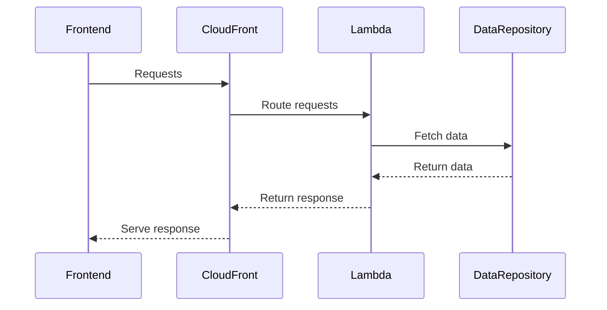

# 🏗 Architecture Documentation

## 📖 Context
* The repository contains AWS CDK code for deploying cloud infrastructure related to a website, including CloudFront distributions and Lambda functions.
* The goal is to set up the necessary infrastructure for hosting a website with different services like accounts, bookmarks, and products.

## 📖 Overview
* The architecture involves setting up CloudFront distributions for different services (accounts, bookmarks, products) with specific cache policies and origin configurations.
* Lambda functions are used to handle requests for specific endpoints related to each service.
* The system follows a serverless architecture pattern leveraging AWS services for scalability and flexibility.

## 🔹 Components
| Component | Description |
| --- | --- |
| FrontStack | Sets up the S3 bucket for the front-end of the website and allows CloudFront access. |
| CloudFrontStack | Configures CloudFront distributions for different services (accounts, bookmarks, products) with specific cache policies and origin configurations. |
| MicroFrontEndFunctionsStack | Creates Lambda functions for handling requests related to accounts, bookmarks, and products. |
| AccountsHandler, BookmarksHandler, ProductHandler | Lambda functions to handle specific service-related requests. |
| AccountsRepository, BookmarksRepository | Data repositories for accounts and bookmarks data. |

## 🔄 Data Flow
* Data flows from the website front-end hosted in the S3 bucket through CloudFront distributions to the respective Lambda functions handling service-specific requests.
* Lambda functions interact with data repositories to fetch and process data related to accounts, bookmarks, and products.

## 🔍 Mermaid Diagram

## 🧱 Technologies
| Technology | Description |
| --- | --- |
| AWS CDK | Infrastructure as Code tool for AWS |
| AWS Lambda | Serverless compute service |
| AWS S3 | Object storage service |
| AWS CloudFront | Content delivery network service |
| TypeScript | Programming language for writing CDK constructs |

## 📝 **Codebase Evaluation**
Objective: Analyze the provided codebase for technical debt, focusing on dependency & coupling, code complexity, and cloud anti-patterns.
* **Dependency & Coupling**:
  - The codebase shows tight coupling between CloudFront distributions and Lambda functions, which could make it challenging to modify or scale the system in the future. Consider decoupling these components for better maintainability.
* **Code Complexity**:
  - The codebase contains multiple nested stacks and complex configurations for CloudFront distributions and Lambda functions. Simplifying the configurations and breaking down the stacks into smaller, more manageable units could reduce complexity.
* **Cloud Anti-patterns**:
  - Hardcoded values like domain names and paths in the code could lead to issues during deployment and maintenance. Consider using environment variables or parameter store for better configuration management.
* **Refactoring Suggestions**:
  - Refactor the code to decouple CloudFront distributions from Lambda functions by introducing an API Gateway layer for better separation of concerns.
  - Extract hardcoded values into configuration files or environment variables to improve flexibility and maintainability.
  - Consider breaking down the monolithic stacks into smaller, reusable components for easier management and scalability.

## 📝 **Codebase Evaluation - Continued**
Objective: Analyze the provided codebase for technical debt, focusing on dependency & coupling, code complexity, and cloud anti-patterns.
* **Dependency & Coupling**:
  - The `MicroFrontEndFunctionsStack` class tightly couples the creation of Lambda functions for product catalog and details. Consider abstracting the function creation logic to reduce coupling and improve reusability.
* **Code Complexity**:
  - The `TypescriptFunction` class contains logic for creating Node.js Lambda functions with specific configurations. Consider extracting common configurations into reusable functions or classes to reduce duplication and improve maintainability.
* **Cloud Anti-patterns**:
  - The use of hardcoded values like paths and domain names in the code can lead to deployment and maintenance challenges. Consider using environment variables or AWS Parameter Store for better configuration management.
* **Refactoring Suggestions**:
  - Abstract the logic for creating Lambda functions into a separate utility class to promote reusability and reduce code duplication.
  - Parameterize the configurations for Lambda functions to make them more flexible and easier to manage.
  - Consider implementing a centralized configuration management approach to handle environment-specific values more effectively.

## 🔹 Components - Detailed Description
| Component | Description | Responsibilities | Interactions |
| --- | --- | --- | --- |
| `CloudFrontStack` | Configures CloudFront distributions | Manages cache policies, origin configurations | Interacts with S3 bucket, Lambda functions |
| `MicroFrontEndFunctionsStack` | Creates Lambda functions | Handles requests for product catalog and details | Interacts with CloudFront distributions, data repositories |
| `CatalogHandler` | Lambda function handler for product catalog | Processes requests for catalog data | Interacts with `CatalogMicroFrontEnd`, `ProductsRepository` |
| `ProductDetailsHandler` | Lambda function handler for product details | Processes requests for product details | Interacts with `ProductDetailsMicroFrontEnd`, `ProductsRepository` |
| `ProductsRepository` | Data repository for product catalog | Retrieves and stores product data | Interacts with Lambda functions, fake catalog data |

## 🔄 Data Flow - Detailed Explanation
* The website front-end hosted in the S3 bucket sends requests to CloudFront distributions.
* CloudFront routes requests to the respective Lambda functions based on the endpoint.
* Lambda functions fetch data from the `ProductsRepository` to process requests for product catalog and details.
* Processed data is returned from Lambda functions to CloudFront for response delivery to the front-end.

## 🔍 Mermaid Diagram - Updated Sequence Diagram

## 🧱 Technologies - Updated Technology Table
| Technology | Description |
| --- | --- |
| AWS CDK | Infrastructure as Code tool for AWS |
| AWS Lambda | Serverless compute service |
| AWS S3 | Object storage service |
| AWS CloudFront | Content delivery network service |
| TypeScript | Programming language for writing CDK constructs |
| tsyringe | Dependency injection library for TypeScript |
| Node.js | JavaScript runtime for Lambda functions |

## 📝 **Codebase Evaluation - Final Recommendations**
Objective: Analyze the provided codebase for technical debt, focusing on dependency & coupling, code complexity, and cloud anti-patterns.
* **Dependency & Coupling**:
  - Implement dependency injection using `tsyringe` to decouple components and improve testability and maintainability.
* **Code Complexity**:
  - Refactor the Lambda function creation logic into separate classes to reduce complexity and improve code organization.
* **Cloud Anti-patterns**:
  - Utilize AWS Parameter Store or Secrets Manager for managing sensitive information like API keys or secrets securely.
* **Refactoring Suggestions**:
  - Implement a centralized logging mechanism to capture and monitor Lambda function logs effectively.
  - Consider implementing automated testing for Lambda functions to ensure reliability and prevent regressions.
  - Evaluate the use of AWS Step Functions for orchestrating complex workflows involving multiple Lambda functions.

This analysis provides a deeper understanding of the architecture and codebase, highlighting areas for improvement and suggesting actionable steps for enhancing the system's design and maintainability.